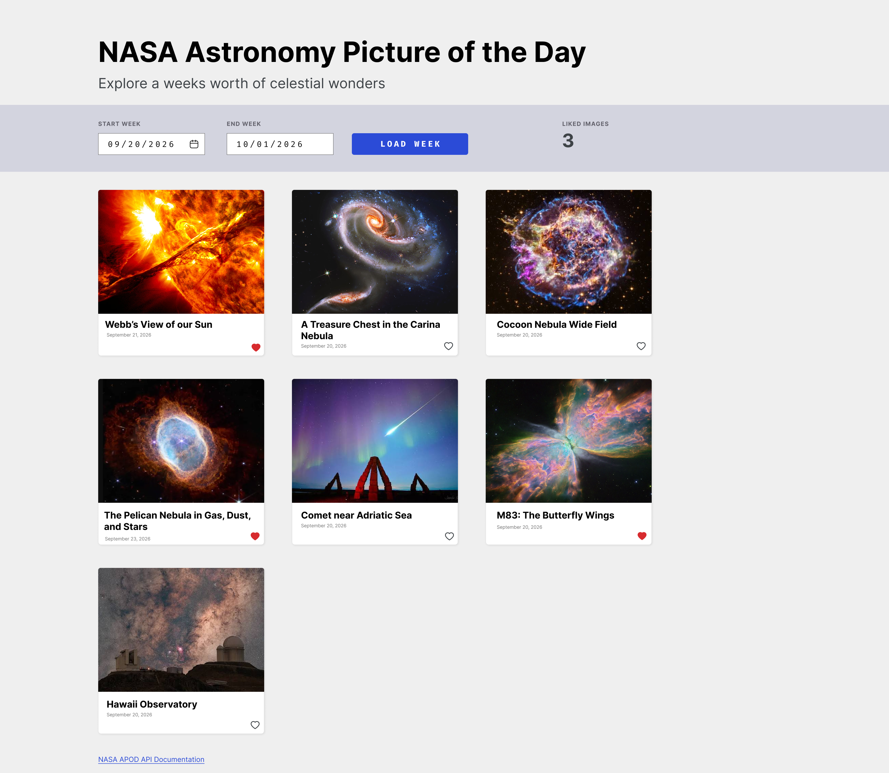

# WILCORE TECHNOLOGIES

# NASA Astronomy Picture of the Day (APOD) App

## Overview

The goal of this challenge is to create an application that displays NASA's Astronomy Picture of the Day (APOD) for a specified timeframe, allowing users to explore a week's worth of celestial wonders. The application should feature a responsive, accessible, and visually appealing interface and support the ability to toggle between different images from the past 7 days.

You will be assessed on your ability to integrate with an API, fixing and troubleshooting bugs, create a responsive UI, and handle errors gracefully.

## Prerequisite

- Node.js v24

## Core Features

### 1. API Integration

- Fetch data from NASA's APOD API. . Use `DEMO_KEY` for the API key, or register for your own key if you exceed the usage limit.
- Retrieve a list of images and their associated information for a **7-day period**. Display one image per day.
- **Caching**: Store the retrieved data locally to prevent repeated API calls for the same information. This can be done using browser storage (e.g., `localStorage` or `sessionStorage`) or in-memory storage if needed.
- **Error Handling**: Ensure proper error handling to manage issues such as failed API calls, rate limits, or connectivity problems.

### 2. Image Display

- **Date Navigation**: Allow users to toggle through dates to view images from the past 7 days relative to a selected date.
- **Image Aspect Ratio**: Display each image in a **1:1 aspect ratio**, ensuring the layout looks visually appealing on multiple screen sizes (e.g., desktop, tablet, mobile).
- **Responsive Design**: The app should be fully mobile-friendly and utilize fluid resizing to ensure a seamless experience on various devices. This includes the use of CSS media queries and flexible layout techniques.
- **Best Practices**: Follow best practices for the React frontend framework (more frameworks coming soon)

### 3. Favoriting System

- **Mark Favorites**: Implement a system that allows users to mark images as favorites. Use in-browser storage (e.g., `localStorage` or `IndexedDB`) to store favorite images so they persist even if the user refreshes the page or revisits the app.
- **View Favorites**: Allow users to access a dedicated page or section where they can view all of their favorited images.
- **Favorite Persistence**: Ensure that favorited images remain in the user's favorites list even after closing the app or refreshing the page.

## Bonus (Optional)

- **Unit Tests**: Write unit tests for key components of the application (e.g., API requests, carousel functionality, or favorite mechanism).
- **UI Enhancements**: Add animations or transitions to improve the user experience (e.g., smooth scrolling, fade-in effects for images).
- **Dark Mode**: Implement a dark mode toggle for users who prefer a darker interface.

## Evaluation Criteria

### Code Quality

- Is the code clean, modular, and organized?
- Are best practices followed, such as proper naming conventions, file structure, and code reuse (DRY)?
- Is the code maintainable and scalable?

### UI/UX

- Is the application visually appealing and easy to use?
- Is the layout responsive, ensuring a good experience on desktop, tablet, and mobile devices?
- Does the image carousel or scroll mechanism provide smooth and intuitive navigation?
- Did you implement the project with a focus on accessibility and usability?

### Functionalit

- Does the app correctly retrieve and display images for the past 7 days from the NASA API?
- Is there a working mechanism for favoriting images, and does it persist across sessions?
- Does the app handle API errors or other issues gracefully (e.g., show a friendly message when the API is down)?

### Creativity

- How creatively have you approached the UI design and user experience?
- Were additional features (such as dark mode, or animations) implemented?

## Deliverables

